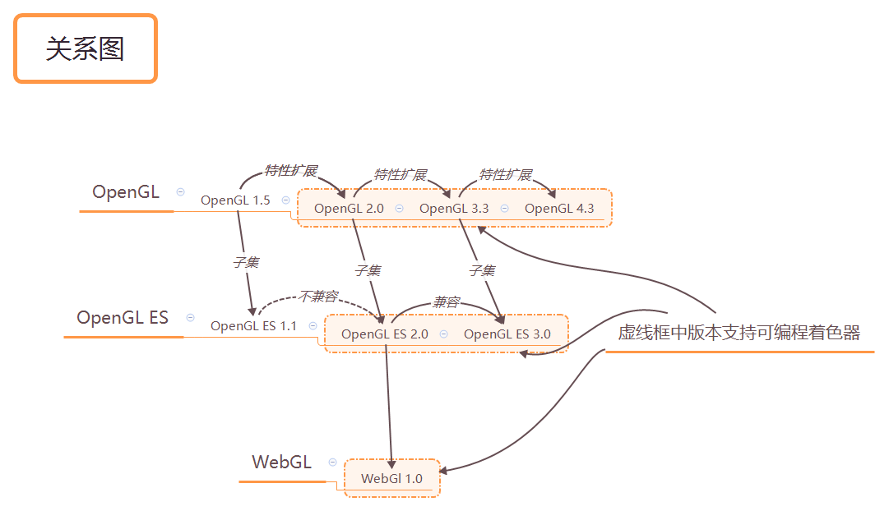

# 概述
- 优势
    - 使用H5标准的canvas，基于浏览器使用webgl
    - 显示和操作三维图形
    - 用于开发三维客户界面，三维网页游戏，将互联网的海量数据进行三维可视化
    - 语言、工具、平台简单
    - 跨平台、轻松发布（传统三维图形程序使用c,c++等语言开发，并未特定平台编译成二进制可执行文件）
    - webgl的技术规范继承自免费、开源的OpenGL标准
    - webgl从Opengl的特殊版本Opengl ES中派生而来，用于嵌入式极端及、智能手机、家用游戏机设备等（2003-2004），轻量级以及渲染能力强（添加了新特性同时从Opengl移除了许多陈旧无用的就特性）
- 起源
    - 个人计算机上是哦那个最广泛的两种三维图形渲染技术：Direct3D和OpenGL
    - 关系图
    - openGL从2.0版本支持可编程着色器方法，并被opengl es2.0继承，并成为webgl 1.0的核心部分
    - 着色器方法，简称着色器，使用类似C的编程语言
    - 着色器语言
        - OpenGL着色器语言-- GLSL
        - OpenGL ES着色器语言 -- GLSL ES
        - WebGL使用ES语言
    - 2011年发布webgl规范的1.0版本
- 程序结构
    - html - javascript - glsl es

# 入门
- canvas是什么？
    - 没有webgl，JavaScript只能在\<canvas\>上绘制二纬图形
    - 有了webgl，JavaScript能在\<canvas\>上绘制三维图形
- 最短的webgl程序：清空绘图区
    - 获取canvas容器
    - 获取上下文context：2d/3d
    - 调用绘制函数
    - 准备：
        - 引入一些专为webgl准备的含数据：webgl-util.js/webgl-debug.js/cunon-utils.js
    - 代码
        ```js
        var canvas = document.getELementById('canvas');
        // 参数2知名是否报错在控制台
        var gl = getWebGLContext(canvas); // 借助utils工具获取上下文，该方法处理了不同浏览器之间的兼容性，
        // webgl继承自OpenGL,所以遵循opengl颜色分量取值范围从0到1
        // clear颜色设置一次后会存储在缓存区，得到：gl.COLOR_BUFFER_BIT
        gl.clearColor(0,0,0,1); // 指定清空canvas的颜色 rgb取值【0.0-1.0】 a取值【0.0-1.0】
        gl.clear(); // 清空canvas
        // 清空画布实际上就是在清空--颜色缓冲区（color buffer)
        ```
    - 缓冲区继承自OpenGL的多基本缓冲区模型，比二位绘图上下文复杂的多
    - 其他缓冲区：颜色缓冲区，深度缓冲区，模板缓冲区
    - 如果不设置clearColor，缓冲区默认值：
        缓冲区名称|默认值|相关函数|非默认时的参数
        -|-|-
        颜色缓冲区|（0，0，0，0）|gl.clearColor(r,g,b,a)|gl.COLOR_BUFFER_BIT
        深度缓冲区|1.0|gl.clearDepth(depth)|gl.DEPTH_BUFFER_BIT
        模板缓冲区|0|gl.clearStencil(s)|gl.STENCIL_BUFFER_BIT
- 绘制一个点
    - canvas坐标系统：左上角为远点（x-向右，y-向下）
    - 单位：像素
    - webgl处理的是三维图形，具有三维坐标
    - 坐标原点在（0，0，0）在canvas的中心位置
    - 用矩形代替圆点，cause矩形比圆简单
    - 暂未使用"缓冲区对象"
    - 【PS】要使用webgl绘图就必须使用着色器
    - 依赖于着色器绘图机制，强大，但复杂，不是简单一条命令就能操作它工作的
        - 【顶点着色器】：描述定点特性的程序（尺寸、位置）
        - 【片元着色器】：进行逐片元处理过程如光照的过程（颜色）。
        - 片元：一个webgl属于，可将其理解为像素（图像的单元）
        - 必须两种着色器
    - 实际场景需要可考虑：光照、观察视角等对场景的影响，着色器可以高度灵活的完成这些工作，提供各种渲染效果。
    - 浏览器webgl接口调用-->在WebGL系统逐顶点操作+逐片元操作-->渲染到颜色缓冲区--->显示到浏览器
    - 【颜色缓冲区】的内容会自动显示在浏览器canvas上
    - 【扩展】如何从文件中加载着色器程序
    - 【WebGL系统】由两个部分组成：顶点着色器和片元着色器
        - 顶点着色器先执行，然后传入片元着色器，再执行片元着色器
    - 【initShader做了什么？】在初始化着色器之前，定点着色器和片元着色器都是空白的，initShader的将JavaScript写的字符串形式的着色器代码传给WebGL系统，并建立着色器。着色器运行在WebGL系统中，而不是JS程序。
- 顶点着色器
    - 控制点的位置和尺寸
    - GLSL ES是一种强类型语言，指明变量类型，所以变量赋值必须按类型复制
    - 必须包含一个main()函数, 关键字void表示无返回值，无参数
    - 内置变量
        类型 | 变量 | 描述 | 必选
        - | - | - | -
        vec4 | gl_Position | 表示定点位置 | 是
        float | gl_PointSize | 表示点的尺寸（像素数）| 否，默认1.0
        类型 | 描述 
        - | -
        vec4 | 表示由4个浮点数组成的矢量, 分量取值范围【0.0-1.0】
        float | 表示浮点数
    - 【齐次坐标】由四个分量组成的坐标（0.0，0.0，0.0，1.0）称为齐次坐标[x,y,z,w]===[x/w,y/w,z/w] w>=0（作用：提高处理三维数据的效率），当第四个分量为1.0时候，“前三个分量可以看作坐标值”
    - 【矢量】x,y,z坐标值 -vec4()-->vec4
    - 【三维图形系统】计算过程，通常使用齐次坐标来表示顶点的三维坐标
- 片元着色器
    - 控制点的颜色
    - 作用：处理片元，使其显示在屏幕上
    - 必须包含一个main()函数，【同顶点】
    - 内置变量
        类型 | 变量 | 描述 | 必选
        - | - | - | -
        vec4 | gl_FragColor | 指定片元颜色（RGBA格式）| 不知道
- gl.drawArray(mode, first, count):一个强大的函数，可会知各种图形，规范如下
    参数 | 描述
    - | -
    mode|指定绘制方式，可接收常量符号：
        gl.POINTS：一系列点
        gl.LINES：一系列单独线段，若为奇数个点，最后一个点忽略
        gl.LINE_STRIP：一系列连接的线段
        gl.LINE_LOOP：一系列连接的线段，形成回路
        gl.TRIANFLES：一系列单独三角形，最后多出的2个或1个点忽略
        gl.TRIANGLE_STRIP：一系列条带状三角形。两三角形共用两个点
        gl.TRIANGLE_FAN：一系列三角形组成类似扇形的图形。所有三角形会共用一个点
    first|指定从那个顶点开始绘制（整数型）（0开始）
    count|指定会只需要多少个顶点（整数型）
    补充|顶点着色器执行的次数为count次，每次处理一个顶点
- WebGL坐标系统
    - webgl处理的是三维图形，所以他使用三维坐标系统（笛卡尔坐标系-右手定则）
    - webgl坐标 <--转换--> canvas坐标
- 绘制一个点（第二版，非硬编码可扩展），借助两个方法：
    - attribute变量：传输与顶点相关的数据（GLSL ES变量，只有顶点着色器可以使用它）
    - uniform变量：所有顶点统一的数据（与顶点无关）
    - 声明一个变量存储位置：attribute vec4 a_Postion; gl_Postion = a_Postion;
    - 从JavaScript向顶点着色器中attribute变量传值
        函数名|参数|描述
        -|-|-
        gl.vertexAttrib1f|location,v0|制定传输给attribute变量的四个分量的值
        gl.vertexAttrib2f|location,v0,v1|制定传输给attribute变量的四个分量的值
        gl.vertexAttrib3f|location,v0,v1,v2|制定传输给attribute变量的四个分量的值
        gl.vertexAttrib4f|location,v0,v1,v2,v3 |制定传输给attribute变量的四个分量的值
    - 函数命名规范遵循OpenGL:基础函数(gl.vertextAttrib)+参数个数(1)+参数类型(f)
    - 函数名后 + v，如：gl.vertexAttrib4fv表示接受数组作为参数
- 鼠标点击绘制一个点
     - 相应鼠标事件
     - 鼠标每次点击的位置都需要记录？WebGL使用的是颜色缓冲区。系统中绘制操作实际是在有颜色缓冲区进行绘制，绘制结束后，系统将缓冲区的内容显示在怕屏幕上。此时你的缓冲区会被重置。【重置：是默认操作】。因此我们需要将每次鼠标位置都记录。
- 改变点的颜色
    - 计算机系统通常使用RGB格式来表示颜色，当加入α（透明度）后，称之为RGBA格式
    - 动态修改点的颜色，将变量传入片元着色器中：使用uniform变量
    - uniform变量，用u_前缀开始
    - 使用片元着色器，要用uniform变量或者varying变量
    - 使用precision设置精度限定，范围以及该精度，mediump等:
        - precision mediump float;
    - 从Javascript向顶点着色器中uniform变量传值
        函数名|参数|描述
        -|-|-
        gl.uniform1f|location,v0|制定传输给attribute变量的四个分量的值
        gl.uniform2f|location,v0,v1|制定传输给attribute变量的四个分量的值
        gl.uniform3f|location,v0,v1,v2|制定传输给attribute变量的四个分量的值
        gl.uniform4f|location,v0,v1,v2,v3|制定传输给attribute变量的四个分量的值

# 绘制与变换三角形
- 绘制多个点
    - 构成三维模型的基本单位是---三角形
    - 上章，点击绘制点逻辑，将点存储在一个数组中，再循环遍历数组，每次遍历向着色器传入一个点，并绘制
    - 但是对由多个顶点组成的图形，如三角形来说，你需要一次性将图形的顶点全部传入顶点着色器，才能将图形绘制出来-------webgl提供另一种机制----缓冲区对象--一次性想着色器传入多个顶点数据---是webgl系统中的一块内存区域----一次性填充大量顶点数据---供顶点着色器使用
    - 使用缓冲区对象向顶点着色器传入顶点数据，遵循5个步骤：
        1. 创建缓冲区对象-gl.createBuffer()--使用WebGL,需要显示的创建缓冲区对象，创建完成后，WebGL系统中多了一个缓冲区对象。
            - gl.deleteBuffer(buffer)删除缓冲区对象
        2. 绑定缓冲区对象-gl.bindBuffer()--将缓冲区对象绑定到WebGL系统中已经存在的target上。target:表示缓冲区对象的用途。target参数值为：
            参数|描述
            -|-
            gl.ARRAY_BUFFER|表示缓冲区对象包含了顶点的数据
            gl.ELEMENT_ARRAY_BUFFER|表示缓冲区对象包含了顶点的索引值
            PS|绑定后WebGL系统状态发生变化，它的target就会指向当前的缓冲区对象
        3. 将数据写入缓冲区对象-gl.bufferData()--效果：将第二个参数的数据写入到第一个参数指定的缓冲区对象上。【我们不能直接向缓冲区对象写入数据，借助target中间件】。第3个参数usage表示程序如何*使用*缓冲区对象中的数据（并帮助webgl优化操作）：
            参数|描述
            -|-
            gl.STATIC_DRAW|只向缓冲区写入一次数据，绘制次数多次--只一次修改，可多次使用（数据不会变）
            gl.STREAM_DRAW|只向缓冲区写入一次数据，然后绘制若干次--一次修改，一次使用（数据每帧都不同）
            gl.DYNAMIC_DRAW|向缓冲区多次写入数据，并绘制很多次--多次修改，多次绘制（数据可被频繁修改）
            - new了一个Float32Array【类型化数组对象】。因为JS中Array是通用对象，没有对“大量元素都是同一种类型”的情况进行优化
            - 【类型化数组对象】：绘制三维图形时，WebGL需要处理大量同类型数据，如顶点坐标和颜色，为了优化性能，WebGL为每种基本数据类型引用了一种特殊的数组---类型化数组--浏览器事先知道数组中数据类型，所以处理起来更有效率：
                数据类型|每个元素占用字节数|用C语言中数据类型描述
                -|-|-
                Int8Array|1|8位整型数signed char
                UInt8Array|1|8位无符号整型数unsigned char
                Int16Array|2|16位整型数signed short
                UInt16Array|2|16位无符号整型数unsigned short
                Int32Array|4|32位整型数signed int
                UInt32Array|4|32位无符号整型数unsigned int
                Float32Array|4|单精度32位浮点数float
                Float64Array|8|双精度64位浮点数double
            - 只能使用new运算符创建
            - PS:与普通数组不同，类型化数组不支持push()和pop()
            - 方法:
                - get(index)
                - set(index.val)
                - set(array,offset)
                - length
                - BYTES_PER_ELEMENT
        4. 将缓冲区对象分配给一个attribute变量-gl.vertexAttribPointer()--实际是将缓冲区对象的引用或指针--分配给attribute变量：
            参数|描述
            -|-
            location|attribute变量的位置，也就是target绑定的缓冲区将指定的变量
            size|【1-4】，指定缓冲区每个顶点需要的分量数，设置不够则自动补全0或1
            type|数据格式：gl.UNSIGNED_BYTE,gl.SHORT,UNSIGNED_SHORT,INT,UNSIGNED_INT,FLOAT
            normalized|true/false
            stride|默认0，指定两个顶点之间的字节数，步进参数，相邻两个顶点之间的字节距离，单个顶点的所有数据字节数。当缓冲区对象只存在一种数据时，将其设置为0就可以了，当存在多种数据时，必须设置该值
            offset|对象偏移量，变量从缓冲区何处开始存储。0是从起始位置开始，字节数
        5. 开启attribute变量-gl.enableVertexAttribArray(location)--这是从OpenGL中继承而来的一个历史原因。看似处理attribute【实际是处理缓冲区】。作用：开启attribute变量，使顶点着色器能够访问缓冲区数据
            - disableVertexAttribArray()
        6. 最后，绘制gl.drawArrays(mode，first，count).count表示多少个点，着色器将会执行多少次
- 绘制三角形
    - 重点在drawArrays(mode, first, count)的摸得参数，设置为gl.TRIANGLES
    - 绘制矩形：
        - WebGL中不支持直接绘制矩形，所有图形由三角形构成
        - 视觉上，矩形4个顶点
        - 实现上，用两个三角形拼合，TRIANGLE_STRIP四个点/ TRIANGLES六个点
        - 【注意】顶点的顺序必须保证，否则绘制失败
- 【*】移动、旋转、缩放（用矩阵简化变换）
    - 操作--称为--变换或仿射变换
    - 将会用到数学知识，开发过程中只需要借用库函数来进行数学计算即可
    - 为了平移一个三角形，需要做什么？
        - 对每个顶点坐标分量(x,y)加上在对应轴上的平移距离。p -方程式-> p'
        - 这种操作---【逐顶点操作】---发生在顶点着色器，，而不是片元着色器
    - 【矢量相加】同类型矢量相加运算--vec4直接相加，两个矢量对应的分量会同时相应相加【GLSL ES提供的特性之一
    - 【变量赋值】GLSL ES中同类型变量可赋值操作
    - 【齐次坐标w分量】在变换坐标中，w分量必须设置为0，保证w1+w2===1.0 
    - 旋转要做什么？
        - 指明旋转轴
        - 旋转方向
        - 旋转角度
    - 右手法则旋转--正旋转-绕Z轴，逆时针--webGL程序的默认设定--逆时针旋转，角度为正值
    - 数学表达式：z不变。旋转α度。x=rcosα  y=rsinα 
        - 三角函数，两角和公式
        - sin(A+/-B)=sinAcosB-/+cosAsinB
        - cos(A+/-B)=cosAcosB-/+sinAsinB
        - 旋转B角后，所以消除A和r后得到：
            - x'=xcosB - ysinB
            - y'= xsinB + ycosB
            - z' = z
        - 将sinB和cosB传给顶点着色器，然后计算得到旋转后的点坐标，使用Javascript内置的Math短袖爱过你中封装的三角函数。。
    - 旋转后显示是的效果与canvas的长宽比例有关系
    - 变换矩阵--旋转
        - 对于简单的变换，我们可以使用数学表达式来实现，但情况复杂时，表达式运算就会相当繁琐。每次变换，都需要重新求取一个等式，实现一个新的着色器，为了简化这一工作---用到
        - 变换矩阵------非常适合操作计算机图形----用矩阵并表示数学计算过程
        - 矩阵 * 矢量 --> 新矢量， 矩阵的乘法不符合交换律 AxB  !== BxA
        - 【*】只有矩阵的列数和矢量的行数数相等时，才能两者相乘。
        - 矩阵如何代表数学表达式？根据上面的三个表达式得到
            ```js
            x' cosB -sinB 0    x
            y' sinB cosB  0    y
            z' 0    0     1    z
            ```
        - 上面中间的矩阵作用：进行一个旋转---所以也叫 ‘旋转矩阵’
        - 转换为4x4矩阵，为了方便和平移矩阵进行组合计算
            ```js
            x' cosB -sinB 0  1  x
            y' sinB cosB  0  1  y
            z' 0    0     1  1  z
            1  0    0     0  1  1
            ```
        - 变换矩阵在三维计算机图形学中应用广泛，所以着色器本身也实现了矩阵与矢量相乘的功能。
    - 变换矩阵 - 平移
        - 矩阵代表数学表达式？因为x'=x+Tx,这个表达式中Tx在x'=ax+by+cz等式中没有，这意味着我们不能用3x3矩阵来表示平移。所以我们使用4x4矩阵以及具有第4个分量的矢量
            ```js
            x'  1   0   0   Tx   x
            y'  0   1   0   Ty   y
            z'  0   0   1   Tz   z
            1  0   0   0   1    1
            ```
        - 上面中间矩阵的作用：平移矩阵
    - GLSL ES中矩阵类型为mat*, 如4x4矩阵为mat4
    - Javascript中没有专门的类型用来表示矩阵，所以需要使用【类型化数组Float32Array】
        - 矩阵是二维的，但数组是一纬的，我们可以按照两种方式在数组中存储矩阵元素
            - 按行主序：一行一行地存
            - 按列主序：GLSL ES中矩阵元素是按列主序存储在数组中的。一列一列地存
        - JS中创建一个将矩阵按列排序的Float32Array的数组
        - 使用gl.uniformMatrix4fv()函数将其传给着色器。v表示可以向着色器传输多个数据值。
            - 第二个参数Transpose,始终设置为false,WebGL中指定为false，WebGL没有提供矩阵转置方法。
    - 变换矩阵 - 缩放
        - 假设在三个方向x,y,z的缩放因子分别为Sx,Sy,Sz，则有
            ```js
            x' = Sx * x
            y' = Sy * y
            z' = Sz * z
            ```
        - 建立矩阵,中间为缩放矩阵   缩放因子为1.0就是保持不变
            ```js
            x'  Sx 0  0  0  x
            y'  0  Sy 0  0  y
            z'  0  0  Sz 0  z
            1   0  0  0  1  1
            ```

# 高级变换与动画基础
- 平移后，再旋转
    - 学习使用一个作者封装好的矩阵变换库，该库封装了矩阵运算的数学细节。
    - 对图形进行复合变换
    - 在写WebGL程序时，手动计算每个矩阵很费时间，所以借助库来隐藏矩阵计算的细节，简化操作。
    - OpenGL提供了一些列有用的函数来创建变换矩阵，如glTranslate()函数创建平移矩阵
    - WebGL没有提供类似函数，借用库cuon-matrix.js，内封装了Matrix类对象，提供了一些列矩阵操作功能：new Matrix()
        函数|参数|描述
        -|-|-
        setRoate|angle,0,0,1|转动角度angle，绕轴转，哪个轴为1
        setIndetity|-|单位矩阵
        setTranslate|x,y,z|移动的距离xx,y,z
        setScale|x,y,z|缩放因子x,y,z
        translate|x,y,z|基于当前matrix乘以一个平移矩阵，再存入当前matrix
        rotate|angle,x,y,z|基于当前matrix乘以一个旋转矩阵，再存入当前matrix
        scale|x,,y,z|基于当前matrix乘以一个缩放矩阵，再存入当前matrix
        set|m|设置为m矩阵
        elements|-|类型化数组，包含Matrix4实例的矩阵元素
    - 【注意】AxB !==BxA，文字描述上后操作的矩阵，在表达式中放前面
        - 先平移，再旋转
        - 旋转矩阵 x 平移矩阵 x 原始坐标------->模型变换/建模变换
        - 因为变换矩阵最终要与三角形三个顶点的原始坐标矢量相乘。
- 动画
    - 旋转动画原理：帧动画，不断擦除和重绘，并再每次重绘时轻微改变角度
    - 借用requestAnamationFrame(),但是这个函数之间时间间隔是不固定的，所以要将时间粒度减小，保证每个时间间隔内的 旋转速度一致， 例如：旋转速度45度/秒。。。旨在当前标签页处于激活状态时才生效。
    - setInterval?为什么不使用？再setInterval诞生之初，浏览器还没有支持‘多标签页’.所以在现代浏览器中，不管标签页是否被激活，setInterval()都会反复执行，标签页一多！就会增加浏览器的负荷。
    - matrix4对象可以共用，用不断覆盖保证是当前该有的矩阵。因为每次创建一个Matrix4对象，会降低代码性能
    - 3D图形编程动画关键：更新图形状态，绘制图形，请求浏览器再次调用tick()

# 颜色、纹理（最后一章基础）
- 将非坐标数据传入顶点着色器
    - 顶点着色器就是接收非一致性的属性，如给每个顶点绘制不同的颜色
    - 发生在顶点着色器和片元着色器之间，从图形到片元的转换------图源光栅化
    - 原理：创建多个缓冲器对象，尺寸对象，颜色对象等，多次指向target，赋值给attribute变量----批量操作
    - 使用多个缓冲区对象向多个着色器传递多种数据的方式只适合数据量不大的情况。当复杂三维图形有成千上万个点呢？如何维护所有的定点数据？
    - 使用gl.vertexAttributPointer()的步进和偏移参数控制，解决大数据量的问题。将数据放在同一个缓冲区，不同数据以相同规律进行【交错组织】
    - 见demo: 10-mass-multi-attribute-point.html
    - BYTES_PER_ELEMENT:类型化数组具有这个属性，可以获取每个元素所占的字节数
    - 修改颜色（varying变量）
        - 之前讲过片元着色器用来处理颜色类属性，现在我们可以将顶点的颜色数据从Javascript传给顶点着色器attribute变量，但是最终影响颜色绘制的gl.FragColor却在片元着色器中
        - 我们需要知道顶点着色器和片元着色器之间如何交流？？如何将数据传给片元着色器？
        - varying变量:从顶点着色器向片元着色器传输数据
- 彩色三角形
    - 将demo10的drawArrays参数改为gl.TRIANGLES即可得到一个颜色平滑过渡的彩色三角形
    - 【问题】谁来确定给定的点就是图形的顶点？谁来确定哪些要素需要着色？谁负责调用片元着色器？着色器怎么处理每个片元？
    - 显示在屏幕上的三角形是由片元（像素）组成。
    - 实际，在顶点着色器和片元着色器【之间】，有两个步骤：
        - 图形装配过程：将孤立的点装配成几何图形，，一股drawArrays()的第一个参数。得到图元。
        - 【光栅化】过程：将装配好的几何图形（图元）转化为片元。片元数，就是这个图形在屏幕上所覆盖的像素数。
    - 光栅化过程结束后，程序调用片元着色器，根据片元的个数，决定着色器的调用次数。一次处理一个片元。
    - 片元着色器计算出片元的颜色，写入颜色缓冲区。知道最后一个片元处理完，将图形显示在浏览器上。
    - 光栅化过程生成的片元都带有坐标信息。我们可以通过片元着色器的内置变量访问到每个片元的坐标：
        - vec类--gl.FragCoord --访问内置变量的第1个和第2个分量表示片元在【canvas坐标系】系统中的坐标值
    - getUniformLocation/ getArributeLocation获取到变量的地址，首先这个地址在渲染器shader中必须声明，在main()中必须使用，如果不适用，将拿不到这个地址。
    - 事实上，片元着色器的v_Color变量与顶点着色器的v_Color变量并不是一回事，这也是为什么称这种变量为varying(变化的)变量的原因。
    - varying变量在传到片元着色器之前，进行了内插过程。如1-0==》1，0.75，0.5，0.25，0
    - 内插过程：颜色不同的两个点之间自动计算出插入的值。----具体-参考《计算机图形学》
    - 【问题AA】内插可以批评话颜色渐变，但是如果遇到逼真的砖墙，这个功能就不够强大了。所以需要采用贴图，如下。
- 在矩形表面贴上图像
    - 将图像（或叫纹理）映射到图形或三位对象的表面，这个过程叫【纹理映射】。
    - 在三位图形学中，【纹理映射】可以解决【问题AA】。
    - 原理：根据【纹理图像】，为光栅化后的【每个片元】图上合适的颜色。组成纹理的像素又叫【纹素】。每个纹素的颜色都是用RGB或RGBA编码。
- WebGL中，纹理映射包含四个步骤：
    1. 准备好映射需要的纹理图像；
    2. 为几何图形配置【纹理映射方式】；
    3. 加载纹理图像，进行配置，并在WebGL中使用；
    4. 在片元着色将纹理的相应的纹素从纹理中抽取出来，并赋给片元。
- 出于安全考虑浏览器默认不允许【跨域资源访问】，所以chrome中需要开启--allow-file-access-from-files选项；firrefox中通过about:config将security.fileuri.strict_origin_policy设置为false。 记得及时该回去。
- 纹理坐标：用来确认那部分覆盖到几何图形。一套新的坐标系统。WebGL中纹理坐标系统是二维的（st坐标系统，或者叫uv纹理坐标系）。
    - 与图像自身尺寸无关。四个坐标分别为：
    - t向上为正，s向右为正，同WebGL坐标系方向
    - （0.0，0.0）左下角
    - （1.0，0.0）右下角
    - （0.0，1.0）左上角
    - （1.0，1.0） 右上角
- 步骤：
    - 创建顶点着色器，接收来自JS的顶点和纹理坐标，光栅化后传给片元着色器
    - 创建片元着色器，接收来自顶点着色器的varying纹理坐标变量，创建取样器u_Sampler从纹理图像中获取纹素颜色的过程，返回颜色值
        - sampler:取样器。由于纹理像素也是有大小的，取样处的纹理坐标可能并不落在某个像素中心，所以取样并不是直接取纹理像素某个像素的颜色，而是【通过附近的若干个像素共同计算而得的】
    - 在片元着色器中，根据片元的纹理坐标,将纹理的纹素抽取出来赋给片元
    - 初始化着色器
    - 初始化对象缓冲器：几何图形顶点，纹理顶点,设置纹理坐标initVertexBuffer()
    - 准备待加载的纹理，让浏览器加载它：initTexture
        - 创建纹理对象，gl.createTexture(无参)，管理webgl系统中的纹理
            - gl.deleteTexture()删除一个纹理对象，重复删除不报错
        - 创建图片对象，new Image()，并设置src。请浏览器加载image纹理图像资源，共WebGL使用，用来映射到几何图形。（先注册事件监听，后加载资源，因为加载资源过程是异步的）
            - 以往使用C或C++编写的OpenGL程序是直接从存储纹理图像的磁盘读取资源是，同步的。
            - WebGL中通过浏览器间接获取资源
        - 纹理图像img.onload后，在WebGL系统中使用纹理loadTexture
            - 先将拿到的图像资源进行【Y轴反转】，因为：
                - PNG、BMP、JPG等格式图片的坐标系统（X向右，Y向下）
                - WebGL纹理坐标系统（X/s向右,Y/t向上）
                - 两个坐标系统Y轴相反，所以需要Y轴反转
                - gl.pixelStorei(gl.UNPACK_FLIP_Y_WEBGL, 1)（pname,param）
                    参数|取值|描述
                    -|-
                    pname|gl.UNPACK_FLIP_Y_WEBGL| 对图像进行Y轴反转。默认值false
                    -|gl.UNPACK_PREMULTIPLAY_ALPHA_WEBGL|将图像RGB颜色值的每个分量乘以A。默认值false
                    param|0(false)或非0(true)|必须为整数，设置前面参数的值
            - 激活纹理单元
                - WebGL通过一种称为【纹理单元】的机制来同时使用多个纹理
                - 每个纹理单元有个单元编号管理一张纹理图像，即使你的程序只需要一张纹理图像，也得为其指定一个纹理单元。
                - 【性能】系统支持的纹理单元个数取决于硬件和浏览器的WebGL实现。默认情况，WebGL至少支持8个纹理单元。
                - 内置单元：gl.TEXTURE0~gl.TEXTURE7各表示一个纹理单元
                - 位于WebGL系统中
                - gl.activeTexture()激活纹理单元，参数：上述纹理单元，一个图片也必须传入纹理单元
            - 绑定纹理对象
                - 告诉WebGL系统纹理对象使用的是那种类型的纹理，即【绑定纹理对象】
                - WebGL支持两种类型纹理
                    类型|描述
                    -|-
                    gl.TEXTURE_2D|二维纹理
                    gl.TEXTURE_CUDE_MAP|立方体纹理
                - gl.bindTexture()，两个参数，target纹理类型(如上),绑定的纹理单元texture
            - 上述步骤操作后，gl.TEXTURE0-->gl.TEXTURE_2D-->纹理对象
                - WebGL中没法直接操作纹理对象，必须通过操作纹理单元来操作纹理对象
            - 配置纹理对象参数
                - 用来设置纹理对象映射到图形上的具体方式
                - gl.texParameteri()参数
                - 方法可以多次调用，多次配置
                    参数|描述|取值
                    -|-|-
                    target|gl.TEXTURE_2D,gl.TEXTURE_CUDE_MAP|纹理类型
                    pname|-|纹理参数
                    -|gl.TEXTURE_MAG_FILTER|gl.LINEAR|纹理放大，纹理小于绘制面板，需要填充像素间的空隙，linear是默认填充方法
                    -|gl.TEXTURE_MIN_FILTER|gl.NEAREST_MIPMAP_LINEAR|纹理缩小，纹理大于面板，需要剔除像素
                    -|gl.TEXTURE_WRAP_S|gl.REPEAT|纹理水平填充，对纹理左侧/右侧区域填充
                    -|gl.TEXTURE_WRAP_T|gl.REPEAT|纹理垂直填充，对纹理上侧/下侧区域填充
                    param|-|纹理参数的值---见上述取值|
                    - | MAG/MIN的非金字塔纹理类型常量|gl.NEAREST距中心最近的像素颜色值,gl.LINEAR距中心最近的4个像素颜色值的加权平均
                    - | T/S的常量|gl.REPEAT重复,gl.MIRRORED_REPEAT镜像对称重复,CLAMP_TO_EDGE纹理图像边缘值
            - 将纹理图像分配给纹理对象
                - gl.texImage2D()将纹理图像分配给纹理对象，并传入参数告诉webGL系统关于该图像的特性
                     参数|取值|秒手术
                     -|-|-
                     target|gl.TEXTURE_2D,gl.TEXTURE_CUDE_MAP|纹理类型
                     level|0|本书不涉及，专为金字塔纹理准备
                     internalformat|gl.RGB等|图像内部格式、纹素数据格式
                     format|取值同上|纹理数据格式
                     type|-|纹理数据类型
                     image|Image对象|JavaScript纹理图像对象
                - 纹素数据格式internalformat/format
                    格式|描述
                    -|-
                    gl.RGB|红蓝绿
                    gl.RGBA|红绿蓝、透明度
                    gl.ALPHA|（0.0，0.0，0.0，透明度）
                    gl.LUMINANCE|l,l,l,1l:流明（流明表示我们感知到的物体表面的亮度）
                    gl.LUMINANCE_ALPHA|L,L,L,透明度
                - 纹理数据格式type
                    格式|描述
                    -|-
                    gl.UNSIGNED_BYTES|无符号整形，每个颜色分量占一个字节
                    gl.UNSIGNED_SHORT_5_6_5|RGB:颜色分量分别占5、6、5比特
                    gl.UNSIGNED_SHORT_4_4_4_4|RGBA:颜色分量分别占4，4，4，4比特
                    gl.UNSIGNED_SHORT_5_5_5_1|RGBA:颜色分量分别占5比特，A分量占1比特
                    PS|除UNSIGNED_BYTES之外，后面格式常用来压缩数据，减少浏览器加载图像的时间
                - 将纹理单元传递给片元着色器
                    - 一旦纹理图像传入了WebGL系统，就必须将其传入片元着色器并映射到图形表面。着色器上用uniform变量存储纹理。
                    - uniform sampler2D u_Sampler;
                    - sampler2D是一种特殊的、专用于纹理对象的数据类型
                        类型|描述
                        -|-
                        sampler2D|绑定到gl.TEXTURE_2D上的纹理数据类型，本书只用这种
                        samplerCube|绑定到gl.TEXTURE_CUDE_MAP上的纹理数据类型
                    - 在initTextures()中，我们得到u_Samplet的存储地址，并通过【纹理单元编号】将纹理对象传给u_Sampler。gl.uniformi(**,0编号) 
                - 从顶点着色器向片元着色器传输纹理坐标
                    - 顶点attribute变量接受顶点的纹理坐标，光栅化后，内插传给片元着色器
                - 在片元着色器中获取纹理像素坐标
                    - texture2D()是GLSL ES内置函数，用来抽取纹素颜色，参数1：纹理单元编号sampler；参数2：纹理坐标coord。
                    - 返回值：gl.RGB/RGBA/ALPHA/LUNIMANCE/LUMINANCE_ALPHA
                    - 将返回值赋值给gl.FragColor
                - 一切准备好后，开始drawArrays()
    - 绘制矩形
- 使用多幅纹理
    - 原理同上
    - vec4 * vec4 =>vec4，GLSL ES中相同类型矢量可以直接相乘，得到结果。 

# OpenGL着色器语言(GLSL ES)
学习OpenGL着色器语言（GLSL ES)及其关键特性。
- 概念
    - 着色器是WebGL渲染三维图形的关键，GLSL ES是专门用来编写着色器的编程语言。
    - 了解GLSL ES后，你将知道【如何编写各式各样的着色器程序】
- 语法
    - 数据、变量、变量类型
    - 矢量、矩阵、结构体、数组、采样器（纹理）
    - 运算、程序流、函数
    - attribute、uniform、varying变量
    - 精度限定词
    - 预处理和指令

本章的知识能帮助你更好的理解更加复杂的三维图形程序。很详细，很枯燥。
>下面语法是GLSL ES 1.00的版本的，WebGL并不支持GLSLES1.00的所有特性，支持吃该版本中的一个自己，包括WebGL需要的核心特性。
### GLSL ES的【目标平台】消费电子产品或嵌入式设备。如智能手机或游戏主机等。所以简化GLSL ES鞥构降低硬件功耗，以及较少性能开销。
GLSL ES用来处理一些通用功能：图像处理和数据运算（所谓的GPGPU）
- 语法
    - 基础
        - 大小写敏感
        - 每个语句用分号；结尾
    - 执行顺序
        - 类似C语言，从main()函数开始，【有且仅有】一个main()函数，且不能接受任何参数
    - 注释
        - // 单行注释
        - /**/多行注释
    - 数据值类型，支持两种
        - 数值类型，整数型。浮点型
        - 布尔值类型，true和false
        - 不支持字符串类型
    - 变量
        - 变量名符合规范：a-z,A-Z,0-9,下划线(_)
        - 首字母不为数字
        - 不能用关键字（attribute，bool等）和保留字（class,default,asm等）
        - 不用gl_,webgl_,_webgl_开头，已经被OpenGL ES保留了
    - GLSL ES是强类型语言
        - 不像javascript，一个var走遍天下。
        - 要求具体指明变量的数据类型来声明变量：<类型><变量名>vec4 a_Position。作用：有利于WebGL系统检查代码错误，提高程序的运行效率。
        - main函数必须指定返回值
        - 赋值操作=的时候，等号左右两侧数据类型必须一样，否则报错。
    - 基本类型
        - float:单精度浮点数类型
        - int:整数型
        - bool:布尔值
    - 赋值和类型转换
        - 赋值（=）,int i =8;
        - 类型转换，用内置函数，如float(): float f1 = float(i);
            转换|函数|描述
            转换为整数|int(float)|浮点数直接去掉整数
            -|int(bool)|true-->1  , false --> 0
            转换为浮点数|float(int)|整型变浮点数，8--》8.0
            -|float(bool)|true-->1.0, false-->0.0
            转换为布尔值|bool(int)|  0-->false  非0 --> true
            -|bool(float)|0.0-->false  非0 ---> true
    - 运算符
        基本同Javascript：+-*  ^^异或，只有当左右有且只有一个为true则为true
    - 矢量和矩阵
        - 这两种数据类型很适合用来处理计算机图形
            类型|描述
            -|-
            vec2/3/4|具有2/3/4个浮点数元素的矢量
            ivec2/3/4|具有2/3/4个整数元素的矢量
            bvec2/3/4|具有2/3/4个博而至元素的矢量
            mat2/3/4|2x2,3x3,4x4的浮点数元素矩阵
        - 赋值和构造
            - 赋值左右类型必须一致：变量/值类型，矢量/矩阵元素个数
            - 使用与数据类型同名的内置【构造函数】来生成变量，如vec4 Position = vec4(1.0,1.0,1.0,1.0)
        - 矢量构造函数很灵活
            ```js
            vec3 v3 = vec3(1.0,2.0,3.0);
            vec2 v2 = vec2(v3);  /* 截取v3的前两个元素作为值*/
            vec4 v4 = vec4(1.0); /*只传入一个参数时，构造函数自动将这个参数值赋给新建矢量的所有元素分量*/
            /*如果构造函数接收到参数【大于1】，单小于期盼的矢量元素个数少，报错*/
            vec4 = vec(vec2, vec4); //矢量组合 =>(1.0,2.0,1.0,1.0)取vec2所有值
            ```
        - 矩阵构造函数
            1. mat4(1.0,2.0...16个列主序排列的浮点数元素...2.0)
            2. 传入一个或多个矢量，按列主序使用矢量的元素构造矩阵。
                - mat2 m2_a = mat2(v2_1, v2_2);->2x2矩阵 或者
                - mat2 m2_b = mat2(v4); ->2x矩阵，前两个为第一列
                - mat2 m2 = mat2(2.0,3.0, v2); // 组合，前两个为第一列
                - mat2 m22 = mat2(1.0); // 将所有元素填充为1.0， 同矢量
        - 访问元素：用.或[]
        - 运算符
            - 点运算符（.），访问矢量分量，如x/y/z/w顶点坐标分量 r/g/b/a颜色分量 s/t/p/q纹理坐标分量
            - 【混合】抽取多个分量： vec2 v2; v2 = v3.xy; -->(1.0,2.0)
            - []运算符，通过下标访问矢量、矩阵元素，从0开始。【访问按列主序读取。】
            - float m23 = m4[1][2]; 获取第2列的第3个元素
            - 同上 float m23 = m4[1].z;
            - 索引值只能是常量索引值，用const做现限制。const int index=0;
            - 矢量和矩阵，比较运算符只能用：== 和 !=
            - 比大小用内置函数 lessThan()
            - *、/、+、-、++、--、=、+=、-=、*=、/=、==、!=
            - 逐分量比较，用equal()和notEqual()
        - 矢量+=*/浮点数 (1.0,2.0) + 0.5 ==> (1.5,2.5)
        - 矢量+=*/矢量 (1.0,2.0)+(1.0,2.0) ==> (2.0,4.0)
        - 矩阵+=*/浮点数 同上，作用于每个元素
        - 矩阵*矢量  每一行 * 矢量列 ==> 新的矢量列
        - 矢量*矩阵 矢量行 * 矩阵每一列 ==> 新的矩阵行
        - 矩阵 * 矩阵 行*列 得到元素个数个等式==>一个新矩阵
    - 结构体
        GLSL ES支持用户自定义的类型，叫【结构体】，关键字struct。将已存在的类型聚合到一起，就可以定义为结构体。
        ```c
        struct light{ // light结构体，像类class
            vec4 color;
            vec3 position;
        } l3; // 定义结构体同时声明了一个变量l3
        light l1, l2; // 声明了light类型的变量l1,l2
        // 不同于c语言，不用typedef关键字来定义结构体，因为结构体名字自动成为类型名。
        ```
        - 赋值和构造
            同名构造函数，如light(参数1，参数2)，参数顺序同结构体成员顺序一致
            ```c
            l1 = light(vec4(1.0),vec3(2.0)); --> color position
            ```
        - 访问成员
            vec4 color = l1.color;
        - 运算符 支持成员数据类型运算
    - 数组
        GLSL ES只支持一维数组，不支持pop()和push()等操作，不用new运算符
        ```c
        float floatArray[4]; // 含4个浮点数的数组
        vec4 vec4Array[2]; // 含2个vec4对象的数组
        // 数组长度必须大于0的整型常量表达式
        // 如
        int size =4;
        float floatArray[size]; // 报错， size必须写为 const int size =4;
        ```
        - 数组的值必须显式子的用下标访问对每个元素进行初始化赋值。不能一次性初始化赋值。
    - 取样器（纹理）
        - 【是GLSL ES的一种内置类型】，
        - 必须通过该类型变量访问纹理。
        - 取样器变量【只能是uniform变量】，或者访问纹理的函数如texture2D的参数。
        - 唯一能赋值给取样器变量的就是纹理单元编号，而且必须使用gl.uniformi(u_Sampler, 0)来赋值
        - mediumpp是一个精度限定字。
        - 受到纹理单元的最大数量的限制
    - 运算符优先级
    - 程序流程控制：分支和循环
        同JS或C几乎无不同。
        - if /if else/ else， 这种语句太多会降低着色器的执行速度
        - 没有switch 语句 
        - for语句，只允许一个int/float类型的循环变量
        - continue,break,discard语句 可以与for和if语句搭配使用
            - discard只能在片元着色器使用，放弃当前片元，处理下一个片元
        - 函数，定义方式不同于JS，类似C。但，不能在函数内部调用本身，不支持递归调用。
            ```c
            /* 返回类型 函数名（type0 arg1, type1 arg1...） {
                函数计算
                return 返回值；
            }
            */
            /*
                调用： 函数名(参数)
            */
            ```
        - 规范声明
            将函数提前进行规范声明，保证在函数定义之前可以调用
        - 参数限定词
            限定词|描述
            -|-
            in|向函数中传值|【默认】可修改，使用，不影响传入的变量
            const in|向函数中传值|可使用，不可修改，不影响传入的变量
            out|在函数中被赋值，并被传出|传入变量的引用，修改后，影响传入变量
            inout|传入函数，并在函数中被赋值，并被传出|传入变量的引用，使用变量初始值，修改值，影响传入变量
        - 内置函数
            类别|内置函数
            -|-
            角度函数|radians,degrees
            三角函数|
            指数函数|
            通用函数|
            几何函数|
            矩阵函数|
            矢量函数|
            纹理查询函数|
        - 全局变量和局部变量
            函数外是全局变量，函数内是局部变量
            - uniform/attribute/varying必须是全局变量声明
        - 存储限定字
            - const/attribute/varying/uniform
            - attribute只能出现在顶点着色器中。
            - 限定字类型变量由最大数目限制，与设备有关，可以通过内置全局参数访问
            - attribute/ 最大const mediump int gl_MaxVertexAttribute/最小 8
            - uniform顶点着色器/最大const mediump int gl_MaxVertexUniformVectors/ 最小 128
            - uniform片元着色器/最大const mediump int gl_MaxFragmentUniformVectors/最小 16
            - varying/最大 const mediump int gl_MaxVaryingVectors/最小 8
        - 精度限定字
            GLSL ES新引入了精度限定字，【目的】帮助着色器程序提高运行效率，削减内存开支。
            - 用来表示内中数据具有的精度（比特数）
            ```c
            // 如果不确定的情况，使用默认如下
            #ifdef GL_ES
            precision mediump float; //所有float默认中精度； 还有highp lowp 可单独修饰变量 lowp float size;
            #endif
            ```
            - 顶点着色器/片元着色器中，int/float/sampler2D/samplerCube都会由默认精度
            - 但是片元着色器中，float 没有设置默认值，【需要手动指定】，如果不指定会报错
        - 预处理指令（支持）
            在代码编译前进行预处理，以#开始
            ```c
            #ifdef GL_ES // 是否已经定义了GL_ES宏
            #endif

            #ifdef 某宏 // 内置宏 GL_ES GL_FRAGMENT_PRECISION_HIGH
            #endif

            #ifndef 某宏
            #endif

            #if 条件表达式
            #else
            #endif

            #define NUM 100
            ```
            
# 三维世界
- 立方体由三角形构成
    - 三维物体由三角形组成，
    - 三维与二维显著区别：三维要考虑【深度信息--z轴】，x，y
- 视点、视线
    - 三维需要考虑观察者：观察方向（视点-在什么位置，看哪里）、可视距离（视线-能看多远）
    - WebGL系统中，默认情况下视点处于原点（0，0，0）,视线为Z轴负半轴
    - 需要知道：视点（视线的起点），观察目标（视线会穿过的点），上方向（将观察到的景象绘制到屏幕，避免 观察者绕着z轴旋转）
    - 上面点分别用一个矢量表示---->创建一个视图矩阵---->将矩阵传给顶点着色器---->影响显示在屏幕上的试图------> Matrix4.setLookAt()创建视图矩阵
    - 默认：视点（0,0,0）视线（0,0,-1）上方向（0,1,0）
- 可视范围（正射类型）
- 可视空间（透视投影）
- 处理对象前后关系
- 立方体

# 光照
光照使场景更具有层次感，如果你希望建立逼真的三维场景，就应当使用光照。
- 光照原理
    - 明暗、阴影、不同类型的光：点光源光（灯光）、平行光（太阳光）、散射光（环境光/间接光：被物体多次反射后照到目标物体表面的光）
    - 物体表面反射光线的方式：漫反射、环境反射
    - 现实世界，光线照在物体上，发生了两个重要的现象：
         - 根据光源、光线方向，物体不同表面明暗程度不同；
         - 根据光源、光线方向，物体投下阴影。
- 运动物体光照效果
- 点光源

# 层次模型
- 多个简单模型组成复杂模型
- 着色器和着色器程序对象

# 高级技术
- 鼠标控制物体旋转
- HUD(平视显示器)
- 雾化(大气效果)
- 绘制图形的点
- α混合
- 切换着色器
- 渲染到纹理
- 绘制阴影
- 加载三维模型
- 相应上下文丢失

# 补充
- webgl中无需交换缓冲区
- glsl es1.0内置函数
- 投影矩阵
- webgl/opengl 左手还是右手坐标系？
- 逆转置矩阵
- 从文件中加载着色器
- 世界坐标系和本地坐标系
- webgl浏览器设置

